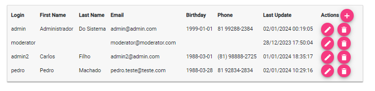
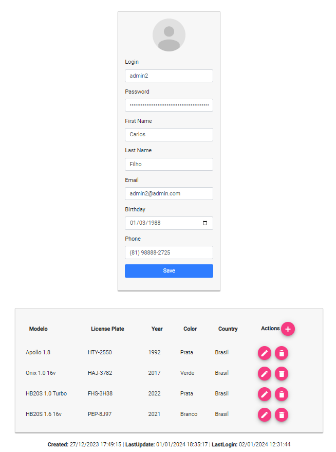
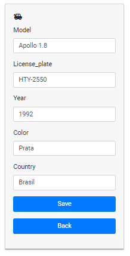

# Angular + Spring Pitang Test - Parte Angular

## Pre-requisitos
- Ter seguido os passos do README.md do código Spring no serviço java:
> [README-Spring.md](../spring-boot-server/README.md)
- Executar o serviço Spring antes.

## Desejável
É importante termos um gerenciador da versão do node.js para facilitar a troca de versões é possível baixá-lo no seguinte link
> https://github.com/coreybutler/nvm-windows#installation--upgrades

Para mais informações a respeito de como utilizar consultar o seguinte link:
> https://www.freecodecamp.org/news/nvm-for-windows-how-to-download-and-install-node-version-manager-in-windows-10/

## Versão Compatível
Para compatibilidade acertada com o projeto desenvolvido recomendo utilizar a versão 16.15.1 do node.js através do seguinte comando:
> nvm install 16.15.1

Para a versão do angular foi utilizada a versão 10.0.0
> npm install -g @angular/cli@10.0.0

## Compilando
Para instalar as dependencias desse projeto utilizar o seguinte comando quando estiver no 
diretório do projeto:
> npm install

## Rodando
Para executar o serviço recomenda-se utilizar o seguinte comando:
ng serve --port 8081

## Ambiente
Navegar até o seguinte link:
> http://localhost:8081/

Será redirecionado para
> http://localhost:8081/home

## Regras
 - Nesta tela serão listados os usuários, assim como, as ações para adicionar (+), editar(/) e remover (■) os usuários, caso
um usuário esteja logado não poderá ser removido, apenas se ele tiver deslogado.
 * Tela de Listagem de usuário (Home)
> 
 - As mensagens, menus e botões estão em inglês para padronizar o teste em si.

 - Para adicionar um usuário deverá ir até o botão "Sign Up" no menu superior ou no botão adicionar(+) na tabela da listagem 
 - dos usuários.

 - Existe uma mensagem de confirmação para que o usuário seja excluido.
 - Apenas é mostrado os dados do usuário e seus carros no menú superior "User Profile", porém este usuário precisa estar logado

 - Com o usuário logado e nesta tela de "User Profile" é possível ver os dados do usuário assim como atualizá-los, 
 - Também aparecem os carros daquele usuário assim como os comandos para adicionar (+), editar (/) ou remover o(s) carro(s) do(s) 
 - usuário(s). 

 - Não é possível cadastrar um usuário com o mesmo e-mail de um que já exista na base
 - Não é possível cadastrar um usuário com o mesmo login de um que já exista na base
 - Não é possível cadastrar um carro com a mesma placa e país, ou seja, placa e país são uma chave composta, pois cada país 
   tem suas regras para manufatura de uma placa, porém dentro de um mesmo país esta não pode se repetir.
* Tela de exibição e edição do usuário logado (User Profile)
> 

* Tela de edição do Carro
> 
   - Após o primeiro login a sessão recebe um token Bearer que será usado para fazer algumas consultas na api spring as 
  quais precisam de autenticação.

## Melhorias Futuras
 - Existem regras de nível de usuário porém para o exemplo foram usadas apenas a verificação básica ao qual ferifica se o 
usuário está logado, porém para futuras melhorias estaria incluso algumas restrições que somente um administrador ou 
moderador poderiam acessar um bom exemplo para este teste seria o fato de um um usuário administrador ter acesso a listagens
mais elaboradas ou mesmo poder editar os carros de qualquer usuário cadastrado.
 - Melhoria do leiaute, pois ficou bem básico e nada visualmente muito atrativo.
 - Melhoria nas validações e retornos de funções.
 - Melhoria nos logs
 - Criação de testes unitários.
