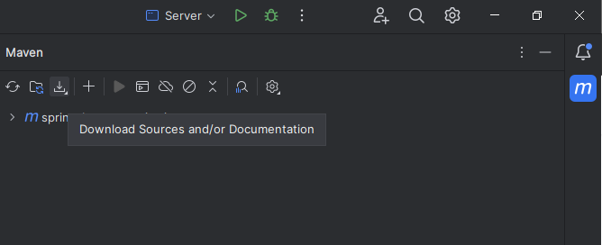
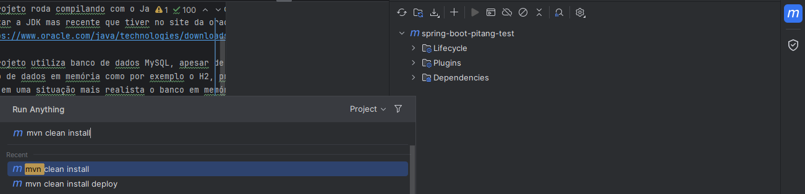
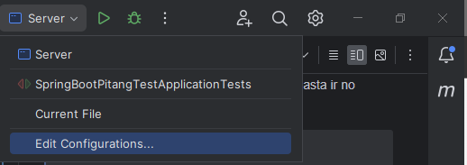
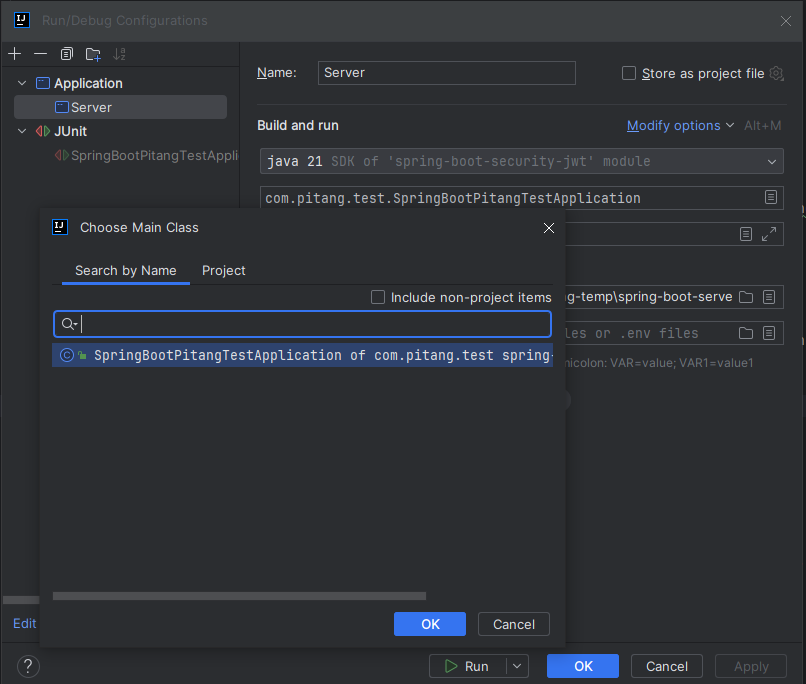
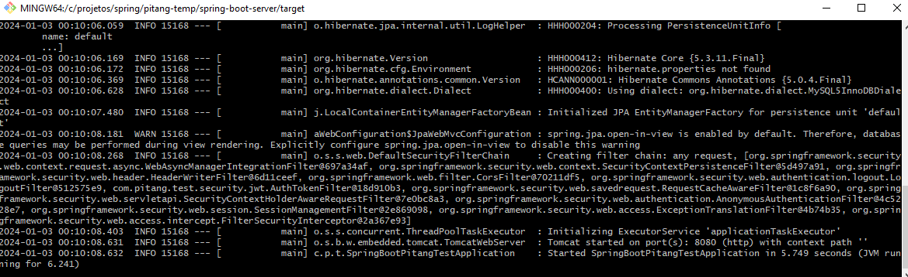

# Angular + Spring Pitang Test - Parte Spring com H2

## Versão Compatível e Pré-requisitos
- Utilizar o Git para clonar o projeto, para fazer o download segue o link:
> https://git-scm.com/downloads
- Comando para clonar:
> git clone [link do projeto]

- O projeto roda compilando com o Java 8 ou 1.8 como mostrado no pom do projeto, porém pode-se 
utilizar a JDK mas recente que tiver no site da oracle:
> https://www.oracle.com/java/technologies/downloads/

- O projeto utiliza banco de dados H2 para testes em um ambiente mais controlado.
- Para o caso de preferir rodar utilizando um banco de dados MySQL favor seguir para o outro projeto 
spring do seguinte Readme.md:
> [README.md do spring-com-mysql](../spring-boot-server/README.md)
- toda a configuração do projeto já está feita dependendo apenas de baixar as dependências do projeto.
- O projeto utiliza dependências pelo maven, portanto para este teste utilizei
 o IntelliJ Community Version para facilitar essa integração apesar de ser
possível baixar o maven separadamente, instalado e baixadas as suas dependências através de 
comandos.
- Para baixar o IntelliJ na versão utilizada basta ir no seguinte link:[README.md](..%2Fspring-boot-server%2FREADME.md)
> https://www.jetbrains.com/idea/download/

- No IntelliJ Community Version basta ir na opção "Download Sources and/or Documentations" para
baixar as dependências do projeto, como mostra a imagem abaixo:
> 

## Compilando
- Para compilar o projeto no ambiente do IntelliJ basta pressionar:
> Ctrl + F9

- Para gerar o jar do projeto para instalação do serviço em algum ambiente basta rodar o
seguinte comando:
> mvn clean install

- No ambiente do IntelliJ onde executar o comando solicitado é mostrado na imagem abaixo:
> 

- Este será gerado dentro da pasta target um exemplo do que deve aparecer quando se executa o comando
esta mostrado no arquivo de log que se encontra na raiz desse projeto:
> mvn-clean-install-example.log

## Rodando serviço
- Para rodar o serviço em ambiente de desenvolvimento ou seja no IntelliJ por exemplo basta ir em 
"Edit Configurations..." e localizar a classe principal do projeto "SpringBootPitangTestApplication"
e mandar rodar como mostra nas imagens a seguir:
> 

> 
- Caso deseje executar o jar compilado através do comando mvn clean install diretamente, basta 
abrir um terminal como por exemplo no windows o cmd ou o próprio git batch estando no caminho 
da pasta onde está o jar e executar o comando:
> java -jar spring-boot-pitang-test-1.0.0.jar

- Há um script de criação das tabelas e inserção dos dados de exemplo
> [script](./src/main/resources/schema.sql)

- Detalhe como a senha é criptografada no banco por uma questão de segurança nesses inserts para 
fim de teste, a senha para todos os usuários inseridos é "testando123";
- Em seguida rodar o serviço em Angular seguindo os passos do README.md do outro projeto:
> [README-Angular.md](../angular-10-client/README.md)

## Melhorias Futuras
- Melhorar Testes Unitários;
- Adicionar o projeto no SonarQube;
- Disponibilizar API Rodando em algum host
- Sessão de Estórias de Usuários para melhor controle de progresso