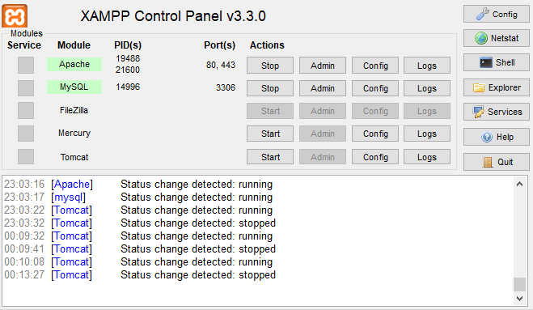
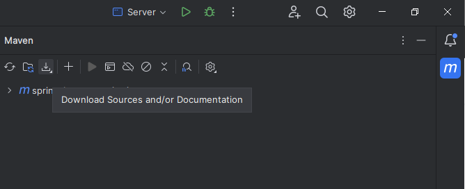
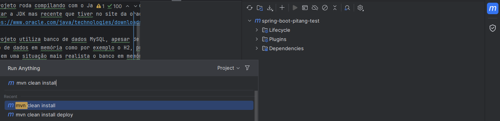
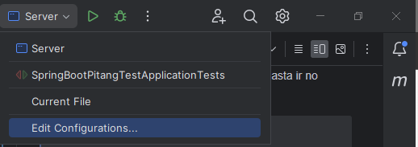
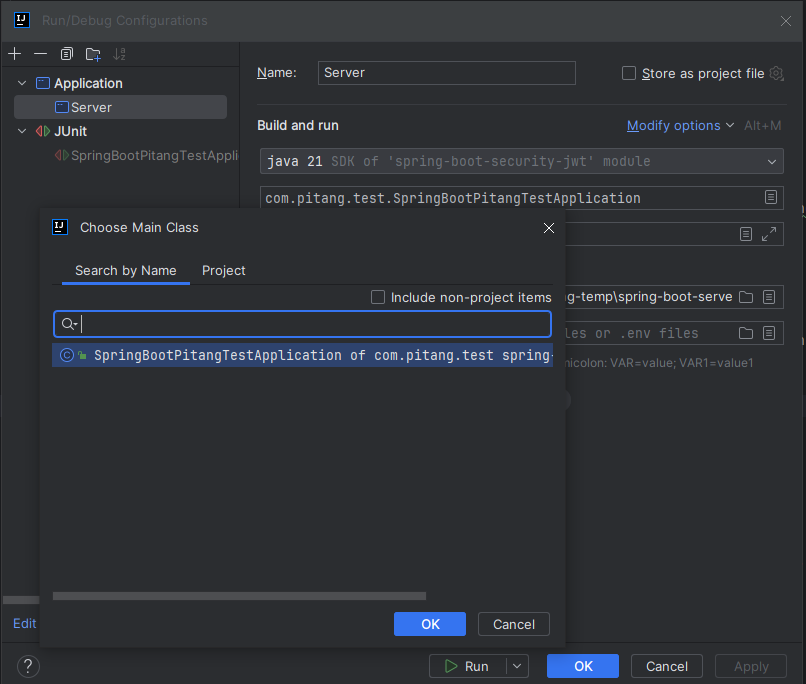
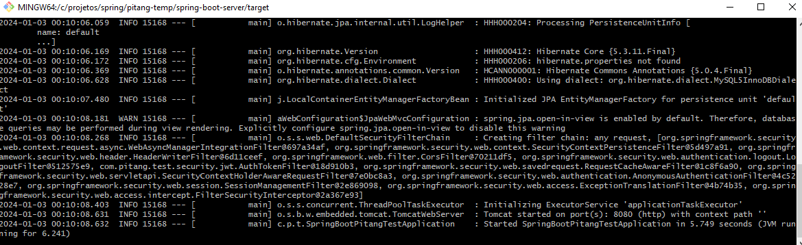

# Angular + Spring Pitang Test - Parte Spring

## Versão Compatível e Pré-requisitos
- Utilizar o Git para clonar o projeto, para fazer o download segue o link:
> https://git-scm.com/downloads
- Comando para clonar:
> git clone [link do projeto]

- O projeto roda compilando com o Java 8 ou 1.8 como mostrado no pom do projeto, porém pode-se 
utilizar a JDK mas recente que tiver no site da oracle:
> https://www.oracle.com/java/technologies/downloads/

- O projeto utiliza banco de dados MySQL, apesar de na solicitação estar pedindo para utilizar 
 banco de dados em memória como por exemplo o H2, preferi utilizar um banco de dados mais convencional,
 pois em uma situação mais realista o banco em memória é mais utilizado para testes unitários 
 ou em rotinas que se exija distribuir dados em memória por conta de desempenho entre outros.

- Porém caso prefira utilizar o banco H2 favor rodar o projeto já configurado para H2 do seguinte 
Readme.md:
> [README.md do spring-com-h2](../spring-boot-server/README.md)
- O proprio pode ser baixando no pacote do XAMPP no link abaixo:
> https://www.apachefriends.org/pt_br/download.html
- Ao instalar o XAMPP iniciar Control Pannel dar "Start" nos serviços do Apache e MySQL como mostra a
imagem:
> 
- Clicar em "Admin"
- Dentro desse SGBD criar um banco de dados com um nome sugestivo como por exemplo "pitang_test_db"
- É recomendável também mudar senha e/ou usuário padrão do mysql assim como criar um novo usuário
para o banco de dados criado para este fim.
- Então configurar os seguintes parametros do "application.properties" do projeto:
> spring.datasource.url= jdbc:mysql://localhost:3306/pitang_test_db?useSSL=false

> spring.datasource.username= usuario_criado

> spring.datasource.password= senha_criada

- O projeto utiliza dependências pelo maven, portanto para este teste utilizei
 o IntelliJ Community Version para facilitar essa integração apesar de ser
possível baixar o maven separadamente, instalado e baixadas as suas dependências através de 
comandos.
- Para baixar o IntelliJ na versão utilizada basta ir no seguinte link:
> https://www.jetbrains.com/idea/download/

- No IntelliJ Community Version basta ir na opção "Download Sources and/or Documentations" para
baixar as dependências do projeto, como mostra a imagem abaixo:
> 

## Compilando
- Para compilar o projeto no ambiente do IntelliJ basta pressionar:
> Ctrl + F9

- Para gerar o jar do projeto para instalação do serviço em algum ambiente basta rodar o
seguinte comando:
> mvn clean install

- No ambiente do IntelliJ onde executar o comando solicitado é mostrado na imagem abaixo:
> 

- Este será gerado dentro da pasta target um exemplo do que deve aparecer quando se executa o comando
esta mostrado no arquivo de log que se encontra na raiz desse projeto:
> mvn-clean-install-example.log

## Rodando serviço
- Para rodar o serviço em ambiente de desenvolvimento ou seja no IntelliJ por exemplo basta ir em 
"Edit Configurations..." e localizar a classe principal do projeto "SpringBootPitangTestApplication"
e mandar rodar como mostra nas imagens a seguir:
> 

> 
- Caso deseje executar o jar compilado através do comando mvn clean install diretamente, basta 
abrir um terminal como por exemplo no windows o cmd ou o próprio git batch estando no caminho 
da pasta onde está o jar e executar o comando:
> java -jar spring-boot-pitang-test-1.0.0.jar

- Lembrando que a estrutura do banco de dados é criada depois do serviço estar rodando
pela primeira vez;
- Após o serviço estar rodando é necessário dar alguns inserts na base de dados
através do SGBD do phpMyAdmin como vimos antes:
> INSERT INTO `roles` (`id`, `name`) VALUES
  (1, 'ROLE_USER'),
  (2, 'ROLE_MODERATOR'),
  (3, 'ROLE_ADMIN');

- Com isso já é possível testar, porém é aconselhavel também inserir mais alguns dados
para que se tenha uma massa de dados para teste seguem os scripts:
> INSERT INTO `cars` (`id`, `color`, `country`, `license_plate`, `model`, `year`) VALUES
(1, 'Prata', 'Brasil', 'HTY-2550', 'Apollo 1.8', 1992),
(2, 'Branco', 'Brasil', 'PEP-8J97', 'HB20S 1.6 16v', 2021),
(15, 'Branco', 'Brasil', 'XHY-7777', 'Fiat Uno', 2014),
(16, 'Cinza Escuro', 'Brasil', 'HYZ-2D37', 'BYD seal', 2023),
(17, 'Verde', 'Brasil', 'HAJ-3782', 'Onix 1.0 16v', 2017),
(19, 'Prata', 'Brasil', 'FHS-3H38', 'HB20S 1.0 Turbo', 2022),
(25, 'Preto', 'Brasil', 'DJS-2J38', 'Duster 1.6', 2022),
(26, 'Preto', 'Brasil', 'DJH-3721', 'Palio 2014', 2014),
(27, 'Branco', 'Brasil', 'DHS-3872', 'Logan', 2017);

> INSERT INTO `users` (`id`, `email`, `password`, `login`, `birthday`, `first_name`, `last_name`, `phone`, `dh_creation`, `dh_last_login`, `dh_last_update`) VALUES
(2, 'admin@admin.com', '$2a$10$hcMskL/TtEo1VGv.5PQXeOBFqoHUNj/uW/Z40O/jn.RY8XzddblpW', 'admin', '1999-01-01 00:00:00', 'Administrador', 'Do Sistema', '81 99288-2384', '2023-12-27 17:49:03', '2024-01-02 00:16:52', '2024-01-02 00:19:05'),
(3, 'moderator@moderator.com', '$2a$10$hcMskL/TtEo1VGv.5PQXeOBFqoHUNj/uW/Z40O/jn.RY8XzddblpW', 'moderator', NULL, NULL, NULL, NULL, '2023-12-27 17:49:11', '2024-01-02 10:30:24', '2023-12-28 17:50:04'),
(4, 'admin2@admin.com', '$2a$10$hcMskL/TtEo1VGv.5PQXeOBFqoHUNj/uW/Z40O/jn.RY8XzddblpW', 'admin2', '1988-03-01 00:00:00', 'Carlos', 'Filho', '(81) 98888-2725', '2023-12-27 17:49:15', '2024-01-02 12:31:44', '2024-01-01 18:35:17'),
(7, 'pedro.teste@teste.com', '$2a$10$hcMskL/TtEo1VGv.5PQXeOBFqoHUNj/uW/Z40O/jn.RY8XzddblpW', 'pedro', '1988-03-28 00:00:00', 'Pedro', 'Machado', '81 92834-2834', '2024-01-02 00:20:39', '2024-01-02 12:30:03', '2024-01-02 10:29:16');

> INSERT INTO `user_cars` (`user_id`, `car_id`) VALUES
(2, 25),
(3, 15),
(3, 16),
(4, 1),
(4, 2),
(4, 17),
(4, 19),
(7, 26),
(7, 27);

> INSERT INTO `user_roles` (`user_id`, `role_id`) VALUES
(2, 3),
(3, 2),
(4, 1),
(7, 1);

- Detalhe como a senha é criptografada no banco por uma questão de segurança nesses inserts para 
fim de teste, a senha para todos os usuários inseridos é "testando123";
- Em seguida rodar o serviço em Angular seguindo os passos do README.md do outro projeto:
> [README-Angular.md](../angular-10-client/README.md)

## Melhorias Futuras
- Melhorar Testes Unitários;
- Adicionar o projeto no SonarQube;
- Flexibilizar a escolha do banco de dados informando melhor como mudar para determinado banco de dados;
- Disponibilizar API Rodando em algum host
- Sessão de Estórias de Usuários para melhor controle de progresso